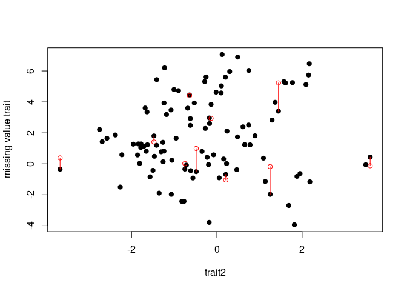

# Loading package

``` r()
library(Rphylopars)
```

# Simulating data

We start this tutorial by simulating 2 traits by Brownian motion (BM)
model without missing values. We did not simulate missing values because
*Rphylopars::simtraits* deletes values from all traits. There is not a
constraint to delete values from one trait. Then, we assigned NA values
randomly to 10 values of the first simulated trait.

``` r
set.seed(2345)
sim <- Rphylopars::simtraits(ntaxa = 100,
                             ntraits = 2,
                             nreps = 1,
                             nmissing = 0,,
                             #v = matrix(c(1, 0.6, 0.6, 1), nrow = 2),
                             model = "BM",
                             nsim = 1
                             )  

trait <- sim$trait_data

trait[sample(1:100, 10), 2] <- NA
```

# Imputation

Here, missing values were imputed by a Brownian motion model.

``` r
phylopars_res <- Rphylopars::phylopars(trait_data = trait,
                                       tree = sim$tree,
                                       model = "BM",
                                       phylo_correlated = TRUE,
                                       pheno_error = FALSE,
                                       pheno_correlated = FALSE
                                       )
```

Imputed values are found in the *anc_recon* element from the *phylopars*
object. *phylopars* estimate values to all tree nodes. Below, there were
filtered the imputed missing values.

``` r
anc <- phylopars_res$anc_recon[1:100, ] 

obs_imput <- data.frame(imputed = anc[, 1], 
                        original = sim$trait_data[, 2], 
                        trait2 = sim$trait_data[, 3])  

obs_imput <- obs_imput[is.na(trait[, 2]), ]
```

This plot shows original (black points) and imputed (red circles)
values. The red lines show the distance between the original and imputed
values.

``` r
plot(x = sim$trait_data[, 3], 
     y = sim$trait_data[, 2],
     pch = 19,
     ylim = c(min(sim$trait_data[, 2]), max(sim$trait_data[, 2])),
     xlab = "trait2",
     ylab = "missing value trait"
     )

points(x = trait[is.na(trait[, 2]), 3],
       y = anc[is.na(trait[, 2]), 1],
       col = "red")

lapply(1:nrow(obs_imput), 
       FUN = function(i) segments(x0 = obs_imput[i, 3], 
                                  y0 = obs_imput[i, 2], 
                                  x1 = obs_imput[i, 3], 
                                  y1 = obs_imput[i, 1], col = "red"
                                  )
       )
```


